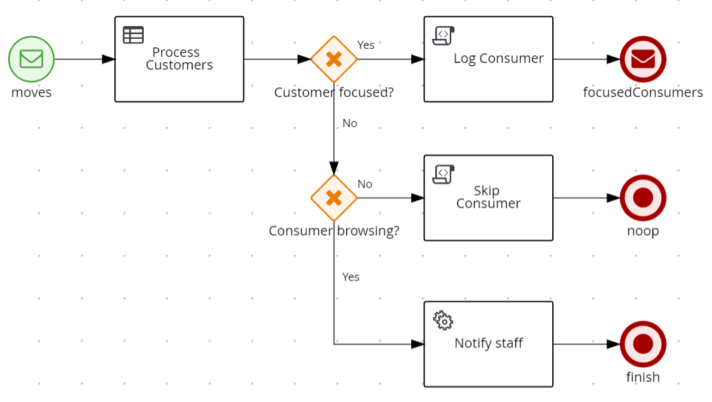

# Customer Movement Decision Service

This project is have-fun-with kind of experiment intended to familiarize myself with Kogito.

The service developed here is a part of imaginary scenario:

Let's assume that there is a retail store that has customer tracking ability (through beacons and mobile app used by the
customer). The app informs the system about current customer location (with MQTT messages). Based on that data, we want
to be able to determine, if a given customer is interested in any particular kind of goods
(in our case: is spending significant time in a given Department.)

## Service overview



The decision process begins with a MQTT message. The message reflects a customer movement around a store.

Then business rules (DRL) are used to:

* identify the department that the customers is currently in
* check how much time he spent in that department (more accurately: how many consequent "moves" he made in that area);
  if he spent some desired time there, the service rules out that he is focused in a given area
  (so, we could probably send him a promo coupon, send notification to the staff to help him out, etc.)

When a focused customer is identified, a proper message is sent.


## Local development/testing

### Prerequisites

You will need:

- Java 11+ installed
- Environment variable JAVA_HOME set accordingly
- Maven 3.6.2+ installed

The service assumes that **MQTT broker is up and running**. It assumes it is accessible on localhost and
use default ports. If you want to supply different settings,
use [application.properties](./src/main/resources/application.properties)

    Please note, that you can use MQTT_HOST and MQTT_PORT environment variables for changing the defaults. 

### Compile and Run in Local Dev Mode

```sh
mvn clean compile quarkus:dev
```

NOTE: With dev mode of Quarkus you can take advantage of hot reload for business assets like processes, rules, decision
tables and java code. No need to redeploy or restart your running application.

### Use the application

The service listens to 'customer/move' MQTT topic. In order to start the decision process (is given a customer focused?)
one should publish a message to that topic.

In case that the decision process finds out that the customer is focused, the result is published to a dedicated topic ('
customer/focus' by default). 


### Changing configuration

MQTT broker address and topics are defined in [application.properties](./src/main/resources/application.properties).

The following environment variables can be used to change the values:


| name | default value | description   |
|------|---------------|---------------|
| MQTT_TOPIC_MOVE     | customer/move | incoming topic for customer position messages |
| MQTT_TOPIC_FOCUS    | customer/focus | outgoing topic for notification about focused customer |
| MQTT_TOPIC_BROWSING | customer/browsing | outgoing topic for notification about customer that is browsing around |
| MQTT_HOST           | 127.0.0.1     | MQTT broker's host |
| MQTT_PORT           | 1883          | MQTT broker's port |


[org.demo.rsotf.CustomerUnit](./src/main/java/org/demo/rsotf/CustomerUnit.java) class holds definition of the
departments (symbols, area on the map) and the number of consequent steps (that customer makes in the same department)
to decide, he is focused there.

Change the following fragments according to your needs:

```java
private int requiredNumberOfSteps=3;
```

```java
private static List<Department> getDepartments(){
        List<Department> departments=new LinkedList<>();
        departments.add(new Department("Women",new Area(444,443,666,879),""));
        departments.add(new Department("Boys",new Area(672,443,992,658),""));
        departments.add(new Department("Girls",new Area(998,443,1317,658),""));
        departments.add(new Department("Men",new Area(672,664,1317,879),""));
        departments.add(new Department("Sports",new Area(614,984,1186,1292),""));
        return departments;
        }
```

(The config should be externalized and available through a config file/environment variables...)

## Additional info

#### Testing with MQTT broker in docker

Quick way to **set up a simple MQTT broker** is to use Docker containers:

```sh
docker run -d --rm -p 1883:1883 --name mosquitto eclipse-mosquitto mosquitto -c /mosquitto-no-auth.conf
```

To **publish to a topic**:

```sh
docker exec mosquitto mosquitto_pub -h 127.0.0.1 -t "test" -m "test message"
```

To **subscribe to a topic**:

```sh
docker exec mosquitto mosquitto_sub -h 127.0.0.1 -t "test"
```

For this particular use case, the following command sends the "user movement" event:

```sh
docker exec mosquitto mosquitto_pub -h 127.0.0.1 -t "customer/move" -m '{"id":"3","ts":0,"x":550,"y":550}}'
```

This command listens to focused customer events:
```sh
docker exec mosquitto mosquitto_sub -h 127.0.0.1 -t "customer/focus"
```

For publishing the same message a few times you can use:
```sh
docker exec mosquitto /bin/sh -c "for i in 1 2 3 4 5; do mosquitto_pub -i client_id -h 127.0.0.1 -t \"customer/move\" -m '{\"id\":\"3\",\"ts\":0,\"x\":550,\"y\":550}'; done"
```

docker exec mosquitto mosquitto_sub -h 127.0.0.1 -t ""


#### Building and packaging

For building and packaging information see: [packaging.md](./packaging.md)

### Implementation walk-through

For the details about how particular parts of the service were implemented, take a look
at [implemantation_walkthrough.md](./implemantation_walkthrough.md).