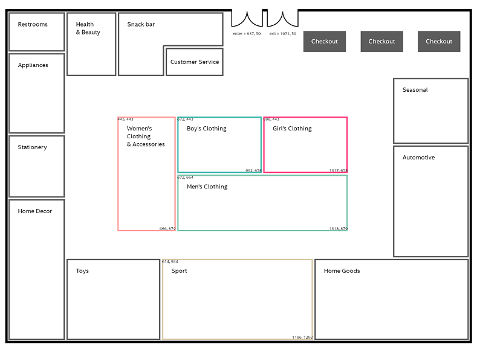

# Overview
The service implements a decision process using Kogito's features:
* BPMN process
* BRMS rules
* messaging

Implemented flow can be illustrated with the following diagram:

The process begins with a MQTT message. The message reflects a customer movement around a store.

Then business rules (DRL) are used to:
* identify the department that the customers is currently in
* check how much time he spent in that department (more accurately: how many consequent "moves" he made in that area);
  if he spent some desired time there, the service rules out that he is focused in a given area
  (so, we could probably send him a promo coupon, send notification to the staff to help him out, etc.)

When a focused customer is identified, a proper Kafka message is sent.

This documents walks through different building block of the service, explaining implementation ideas/mechanics.

## The background

### Store plan
Let's assume we have a retail store with the following plan:

In the picture, you see particular **departments' placement** (with coordinates -- the small print in the top-left corner of
designated areas).

    This image is a variation of retail store template from SmartDraw.com. 
    See: https://cloud.smartdraw.com/editor.aspx?templateId=a0706c33-845a-4ae4-b71c-febf9a8b4b4a&flags=128

We see, for example, that _Boy's Clothing_ department occupies rectangular area
(672, 443 -- 992, 658).

This information is important, because we want our decision process to be able to determine in which department
is the customer located (based on his x,y coordinates).

### Customer movement tracking
Let's assume, that the store infrastructure is able to track customer movement around the store
(for example using beacons and mobile app). The location system is not aware of the type/name of the department that
the customer is. It's just aware of his identity (ID) and coordinates (x, y).

We'd have three types of events in the system.

**customer/entry** -- signals the moment, when the customer enters the store.

| Name | Type | Description | Accepted values |
|---|---|---|---|
| id | string | ID of the customer | ...|
| ts | integer | Timestamp of the event, in seconds since epoch | ...|

Example of payload: `{ "id": "127", "ts": 192322800 }`

**customer/exit** -- informs the system, when the customer enters the store.

| Name | Type | Description | Accepted values |
|---|---|---|---|
| id | string | ID of the customer | ...|
| ts | integer | Timestamp (unix time) | ...|

Example of payload:`{ "id": "127", "ts": 192322800 }`

Probably, the most interesting one, **customer/move**.

| Name | Type | Description | Accepted values |
|---|---|---|---|
| id | string | ID of the customer | ...|
| ts | integer | Timestamp (unix time) | ...|
| x | integer | coordinate x | ...|
| y | integer | coordinate y | ...|

Example of payload: ` { "id": "127", "ts": 192322800, "x": 0, "y": 0}`

# Implementation

## Receiving MQTT messages
TODO

## Business rules
In this implementation we use these features of business rules engine:
* **salience** -- for controlling the sequence of the rules
* **activation-group** -- for exclusive execution of rules in a group
* Producing intermediary facts
* using a variable/constant from RuleUnit
* using a service in a rule (invoke some action, like read some data from a cache)

